# Supplementary Material

This document contains supporting material for the paper *What Drives
LLM-Generated Hypotheses? Attribution-Informed Context Engineering for
Scientific Discovery*. It collects per-model figures, full per-cell confidence
intervals, normalized-share results, compute-cost details, and dataset-exploration
analyses that were omitted from the main text for space. All figures are produced
by `scripts/run_analysis.py` and stored under `results/figures/`. Raw per-abstract
attribution records (~540 MB per model) are archived on Zenodo (see
[Raw Data](#raw-data)).

## Contents

- [S1. Full Mean Attribution with Confidence Intervals](#s1-full-mean-attribution-with-confidence-intervals)
- [S2. Per-Model Attribution Figures](#s2-per-model-attribution-figures)
- [S3. Normalized Attribution Shares](#s3-normalized-attribution-shares)
- [S4. Dataset Exploration](#s4-dataset-exploration)
- [S5. Computational Cost](#s5-computational-cost)
- [S6. Length Confound Across Models](#s6-length-confound-across-models)
- [Raw Data](#raw-data)
- [Author Contributions](#author-contributions)

## S1. Full Mean Attribution with Confidence Intervals

Table 4 in the paper reports mean (SD) only. Below is the full version including
95% bootstrap confidence-interval half-widths (B = 2000). Format: mean (SD)
[± CI half-width]. SD describes per-abstract spread; the bracketed CI describes
precision of the mean (n ≈ 1,300–1,940 per section).

| Section | TinyLlama FA | TinyLlama Shapley | Phi-3 FA | Phi-3 Shapley | Llama-3.1-8B FA | Llama-3.1-8B Shapley |
|---|---|---|---|---|---|---|
| Background | 22.3 (28.8) [±1.26] | 30.6 (29.2) [±1.28] | 26.5 (29.6) [±1.30] | 33.6 (29.4) [±1.29] | 22.3 (25.6) [±1.15] | 27.9 (25.1) [±1.11] |
| Method | 27.9 (29.7) [±1.32] | 38.5 (31.2) [±1.39] | 36.7 (36.3) [±1.65] | 44.1 (36.7) [±1.68] | 31.9 (30.7) [±1.44] | 38.9 (30.1) [±1.39] |
| Objective | 18.7 (21.4) [±1.22] | 28.7 (22.8) [±1.26] | 27.0 (27.9) [±1.57] | 34.4 (28.2) [±1.58] | 22.9 (24.1) [±1.35] | 30.0 (23.8) [±1.33] |
| Result | 18.6 (24.8) [±1.15] | 27.0 (26.3) [±1.24] | 18.2 (25.8) [±1.22] | 24.2 (26.6) [±1.27] | 24.2 (26.8) [±1.31] | 28.9 (27.3) [±1.33] |
| Other | 3.0 (7.3) [±0.79] | 5.3 (8.6) [±0.93] | 2.2 (9.9) [±1.07] | 5.1 (10.9) [±1.16] | 4.0 (11.8) [±1.31] | 5.1 (12.2) [±1.32] |

The Method > Background ordering holds with non-overlapping CIs for every model,
consistent with the Friedman tests reported in the paper.

## S2. Per-Model Attribution Figures

The main text shows figures for TinyLlama-1.1B. The Phi-3-mini-4k and
Llama-3.1-8B patterns are qualitatively identical: the hierarchy
Method > Background > Objective ≈ Result ≫ Other is preserved at every scale.

### Phi-3-mini-4k (3.8B)

Mean attribution per section:

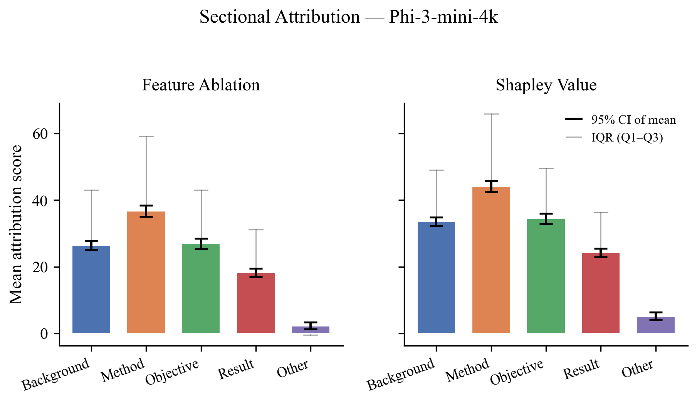

Top-ranked section frequency (Method 37.7% Shapley; Other 0.4%):

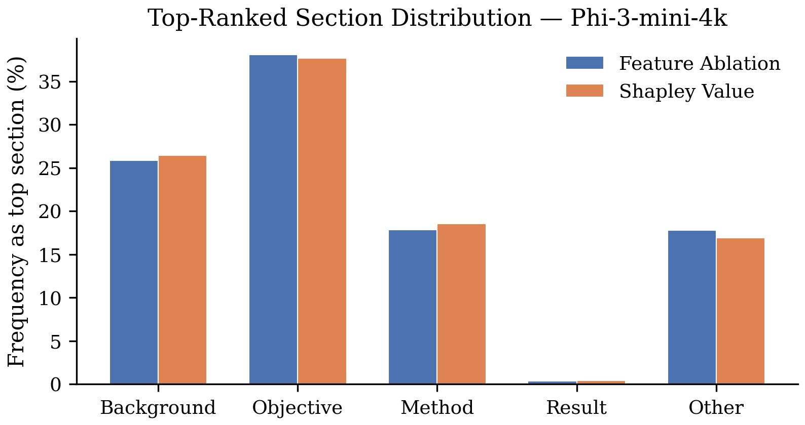

Feature Ablation vs. Shapley agreement (Spearman ρ = 0.944, the highest of the
three models):

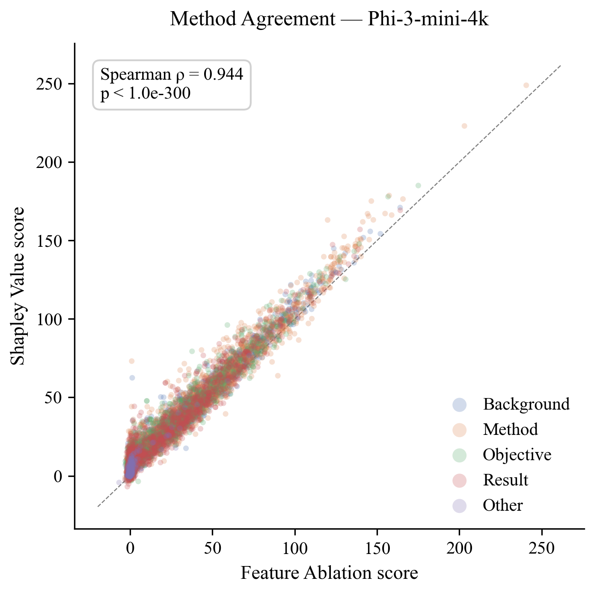

Attribution score distributions:

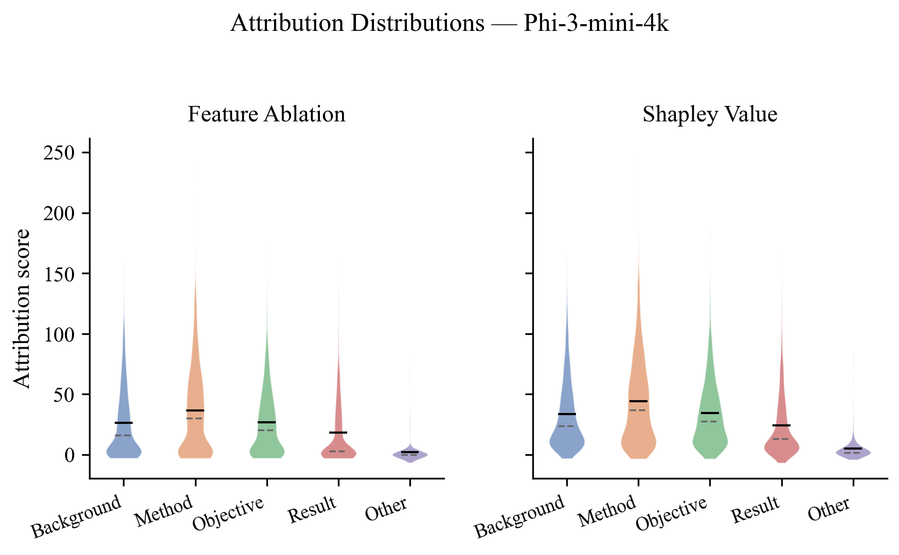

Length vs. attribution:

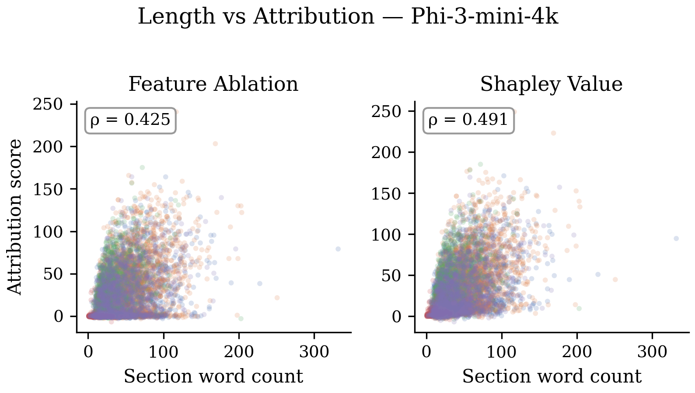

### Llama-3.1-8B-Instruct (8B)

Mean attribution per section (Result's prominence increases relative to the
smaller models):

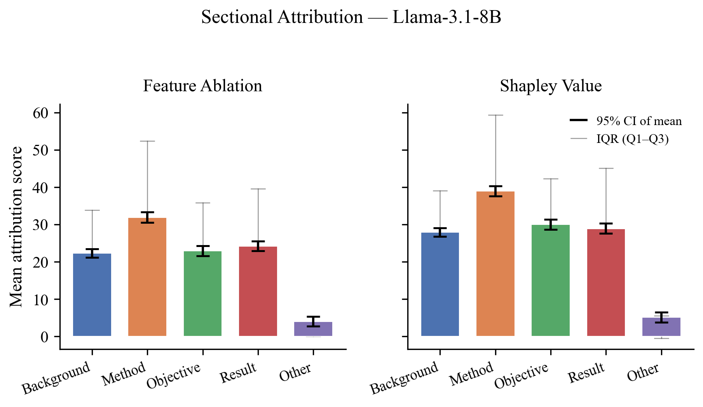

Top-ranked section frequency (Method 36.5% Shapley; notably Result 23.0% slightly
exceeds Background 22.1%, the only model where this occurs):

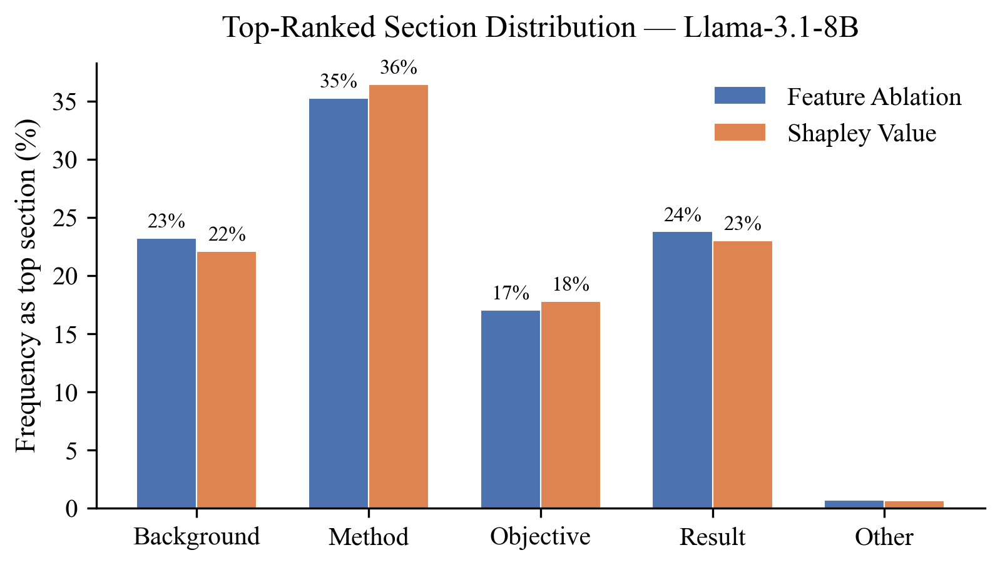

Feature Ablation vs. Shapley agreement (Spearman ρ = 0.938):

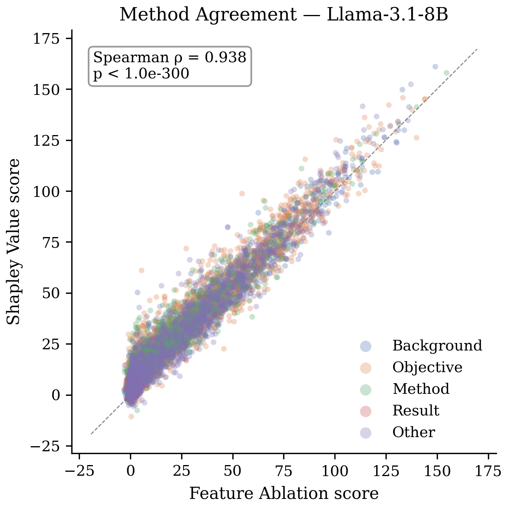

Attribution score distributions:

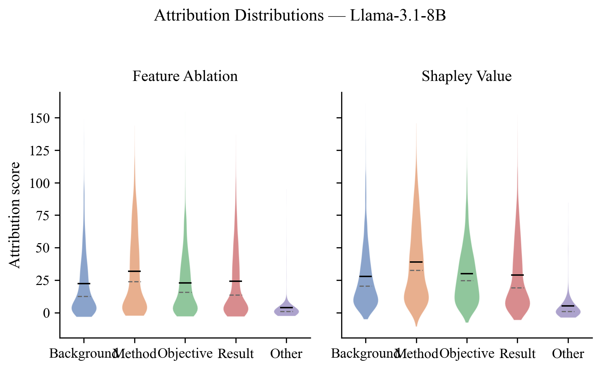

Length vs. attribution:

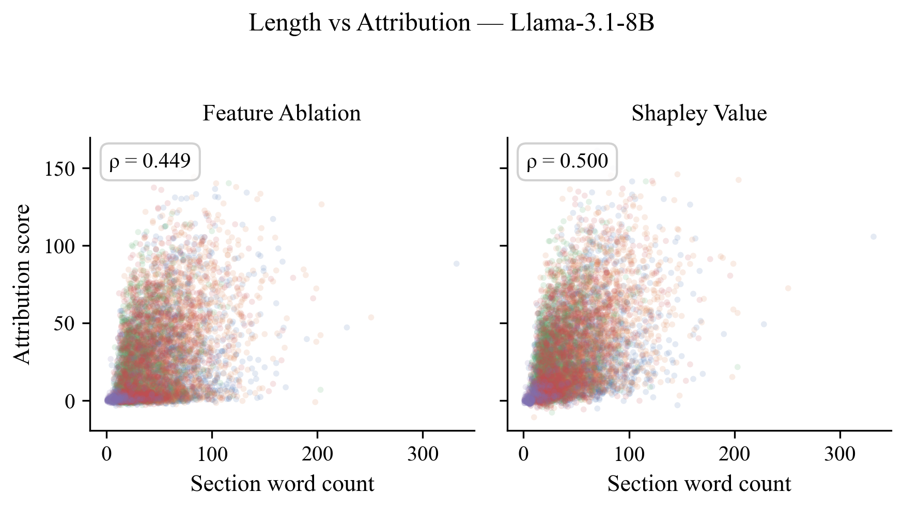

## S3. Normalized Attribution Shares

The absolute attribution scores in the main text inherit two incidental scale
factors: the length of the generated hypothesis and the per-abstract baseline
log-probability. To remove both, we report a within-abstract normalized share:
for each abstract, each section's score is divided by the sum of positive section
scores in that abstract, giving a unitless quantity bounded in [0, 1].

Mean normalized share (Shapley), reported as mean [± 95% bootstrap CI half-width]:

| Section | TinyLlama-1.1B | Phi-3-mini-4k | Llama-3.1-8B |
|---|---|---|---|
| Background | 0.309 [±0.010] | 0.319 [±0.011] | 0.285 [±0.010] |
| Method | 0.372 [±0.010] | 0.386 [±0.012] | 0.378 [±0.012] |
| Objective | 0.297 [±0.011] | 0.319 [±0.013] | 0.304 [±0.013] |
| Result | 0.267 [±0.010] | 0.226 [±0.011] | 0.284 [±0.012] |
| Other | 0.067 [±0.014] | 0.054 [±0.012] | 0.062 [±0.014] |

The hierarchy is preserved, with Method capturing ~37–40% of within-abstract
attribution and Other only ~5–7%. Because the quantity is bounded per abstract,
the CIs are very tight — a model-independent check that the main-text hierarchy
is not an artefact of scale variation across abstracts.

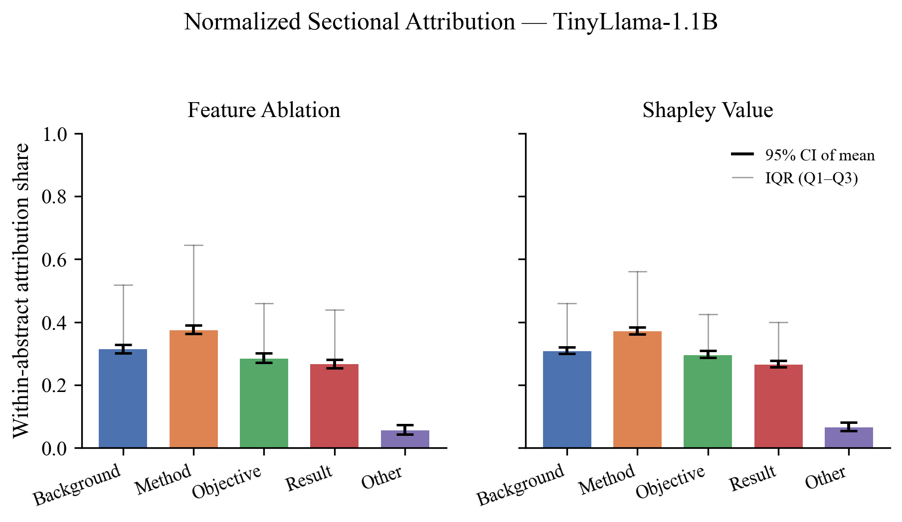

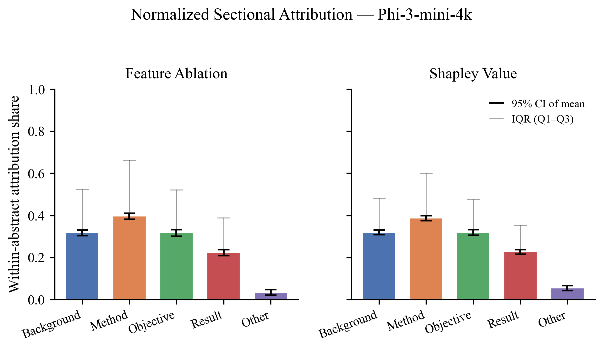

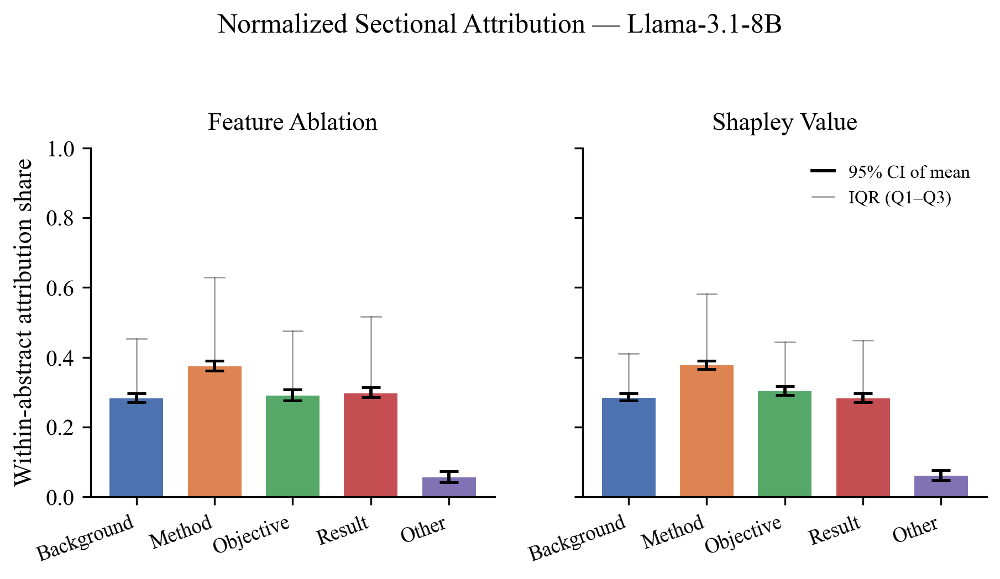

## S4. Dataset Exploration

### Label Distribution

Sentence-level label counts across the full dataset (all splits combined, 2,153
abstracts after filtering). Background and Method together account for roughly
two-thirds of all sentences; Other is rare at 3%.

| Label | Sentences | Proportion |
|---|---|---|
| Background | 4,698 | 0.32 |
| Method | 4,642 | 0.32 |
| Objective | 1,724 | 0.12 |
| Other | 459 | 0.03 |
| Result | 3,048 | 0.21 |
| **Total** | **14,571** | **1.00** |

The contrast between prevalence and influence is the key point: Objective is only
12% of sentences yet ranks first in 17–19% of abstracts, while Other (3% of
sentences) ranks first in under 1% — evidence that content type, not exposure,
drives attribution.

### Abstract Length

Abstracts contain a mean of 6.7 sentences (SD 2.0), ranging from 3 to 10, with
most between 5 and 9. This short length keeps all abstracts within the range
where perturbation-based attribution is not dominated by long-context positional
bias.

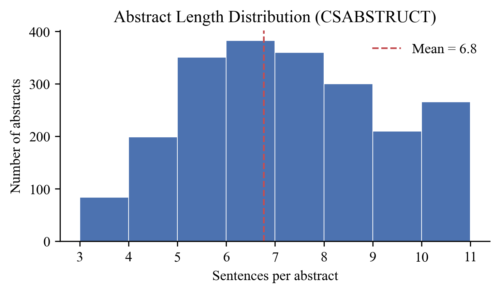

### Section Co-occurrence

Percentage of abstracts containing each section (diagonal) and each pair of
sections (off-diagonal).

|  | Bg | Obj | Meth | Res | Other |
|---|---|---|---|---|---|
| Background | 90.1 | – | – | – | – |
| Objective | 50.9 | 59.2 | – | – | – |
| Method | 77.5 | 50.3 | 86.9 | – | – |
| Result | 70.8 | 46.4 | 70.0 | 79.5 | – |
| Other | 12.4 | 8.0 | 11.3 | 9.5 | 14.2 |

Other appears in only 14.2% of abstracts and is the binding constraint for the
Friedman test, which requires all five sections to be present (79 abstracts).

## S5. Computational Cost

Per-abstract attribution time and total wall-clock cost (NVIDIA A100 80GB).
Coalition caching keeps Shapley Value Sampling to ~2.5× the cost of Feature
Ablation.

| | TinyLlama | Phi-3 | Llama-3.1-8B |
|---|---|---|---|
| FA time/abstract (s) | 0.090 | 0.099 | 0.158 |
| Shapley time/abstract (s) | 0.231 | 0.243 | 0.391 |
| Shapley/FA ratio | 2.6× | 2.5× | 2.5× |
| Total wall-clock (min) | 62.5 | 53.2 | 90.8 |

## S6. Length Confound Across Models

Spearman correlation between section word count and attribution score across all
section–abstract pairs. The correlation is moderate for every model, indicating
content type rather than length is the primary driver (length explains ~16–25% of
variance via ρ²).

| Model | FA ρ | Shapley ρ |
|---|---|---|
| TinyLlama-1.1B | 0.405 | 0.467 |
| Phi-3-mini-4k | 0.425 | 0.491 |
| Llama-3.1-8B | 0.449 | 0.500 |

## Raw Data

Pre-computed `summary.csv` files (one row per abstract, all attribution scores,
word counts, timing, and agreement flags) are tracked in this repository under
`results/`. Complete per-abstract JSON records — including full text, labels, and
all Shapley marginal-contribution samples (~540 MB per model) — are archived on
Zenodo: **[DOI to be added]**.

## Author Contributions

Adnan Mahmud led the project, with primary responsibility for conceptualisation,
software implementation, data curation, formal analysis, and the original
manuscript draft. Abbi Abdel Rehim and Gabriel Reder contributed to the
theoretical formulation, methodology, and validation, and to critical review and
editing. Ross King and Amy Wilson provided supervision, secured resources, and
managed project administration.
